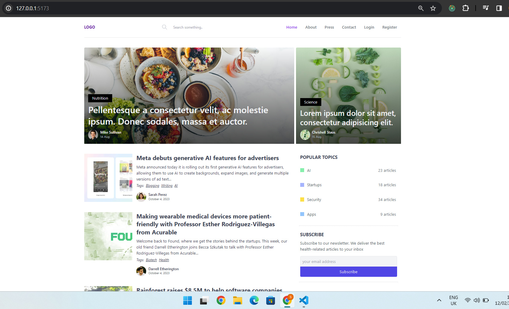

Blog application with pagination and categorization features using React JS, Redux Toolkit, and Tailwind CSS. Redux Toolkit is used to manage the application state, including pagination state, blog data, and category selection. Tailwind CSS ensures that the application maintains a visually appealing layout across different screen sizes. Axios is used to make API requests and handle responses.

